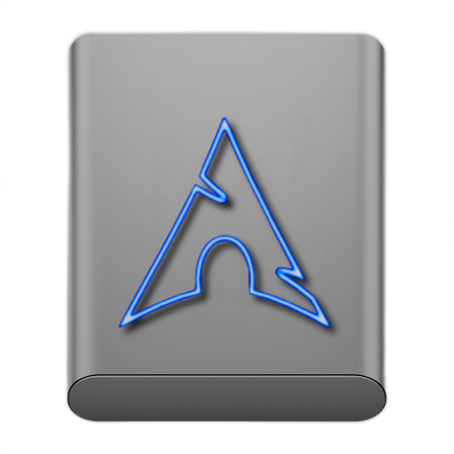

# Linux Tahoe Style Disk

### Collor macOS Tahoe Disk ⬇︎ View All ➥ [Collor IconSet 512px](https://github.com/chris1111/Linux-Tahoe-Style-Disk/blob/main/View-Set.md)

### Original macOS Tahoe Grey Disk ⬇︎ View All ➥ [Grey Disk IconSet 512px](https://github.com/chris1111/Linux-Tahoe-Style-Disk/blob/main/View-GreySet.md)

Downloads: Release ➤ [Linux Tahoe Style Disk](https://github.com/chris1111/Linux-Tahoe-Style-Disk/releases/download/V1/Linux_Icons-512px.zip)

Other Linux Icons  ➤ [Linux_Grey_Rond](https://github.com/chris1111/Linux_Grey_Rond) ➤ [Linux-Logo-LineForm](https://github.com/chris1111/Linux-Logo-LineForm) ➥ [Purple_Ring_Linux_Logo](https://github.com/chris1111/Purple_Ring_Linux_Logo) 

➥ [Linux_Android_Icons](https://github.com/chris1111/Linux_Android_Icons) ➤ [Linux-Logo-Black-White](https://github.com/chris1111/Linux-Logo-Black-White) ➤ [Linux-Logo-Blue-Grey](https://github.com/chris1111/Linux-Logo-Blue-Grey)

